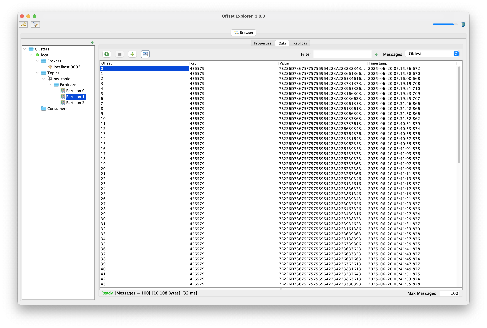
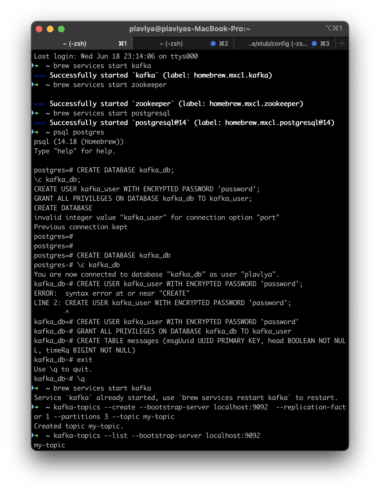
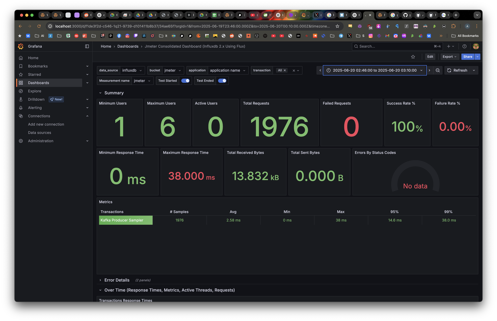
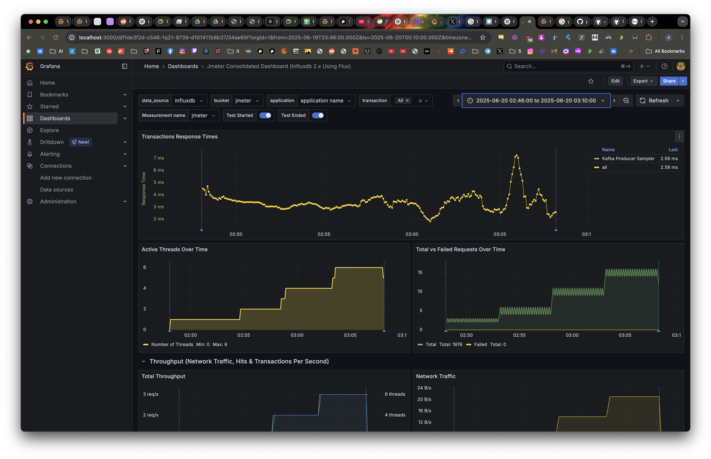
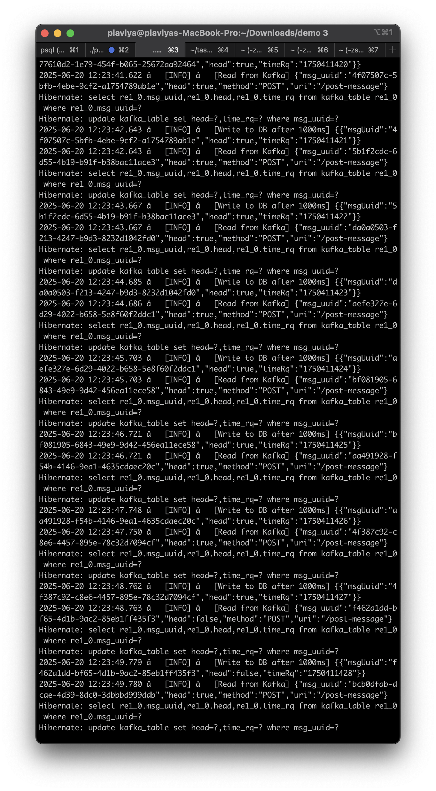
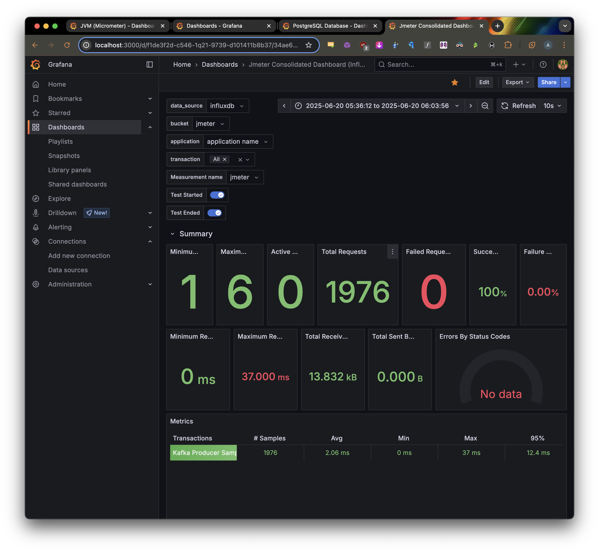
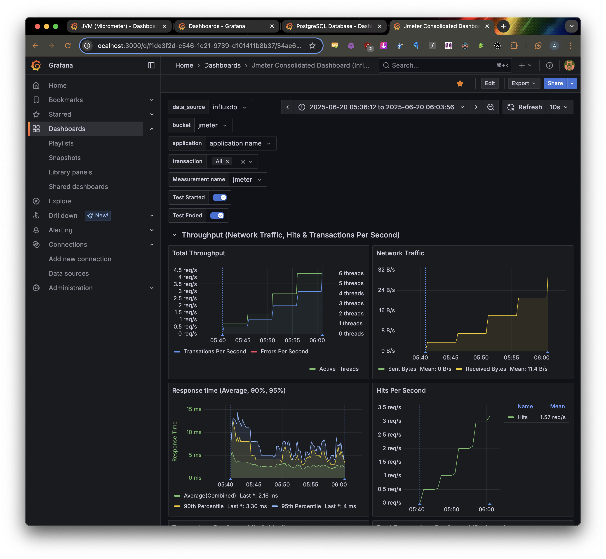
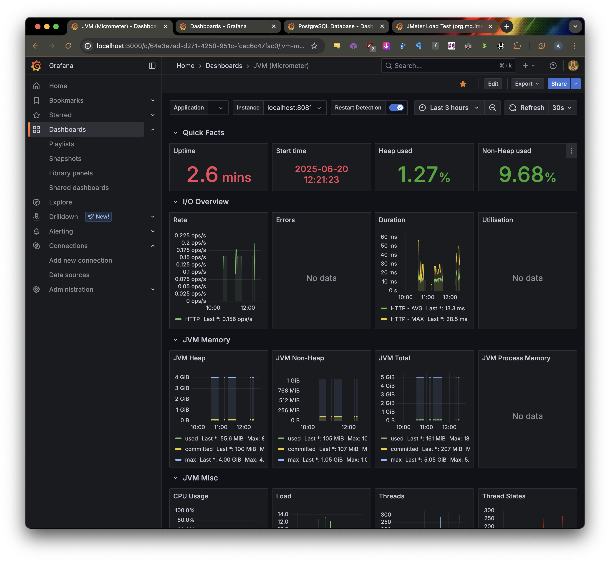
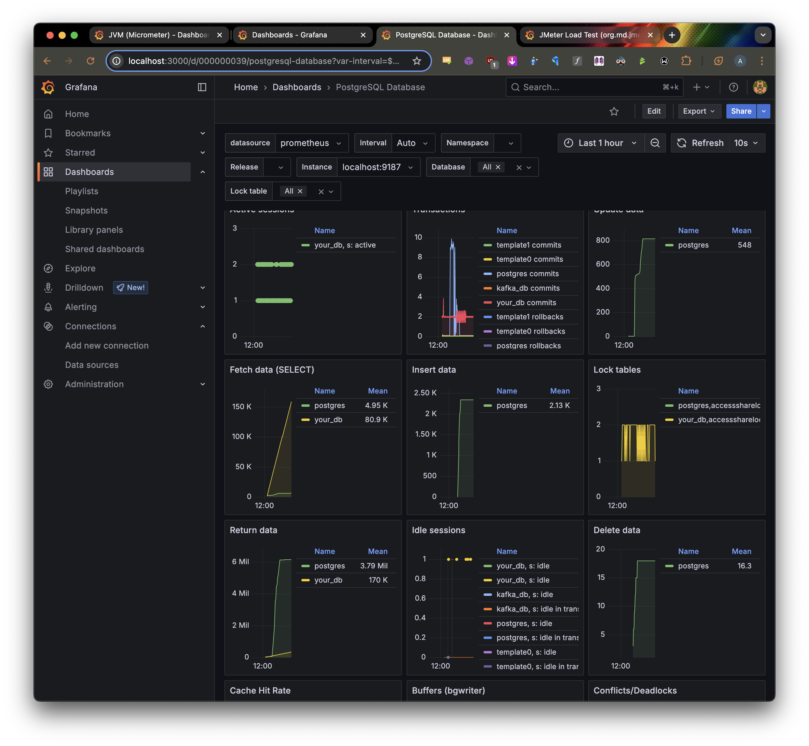
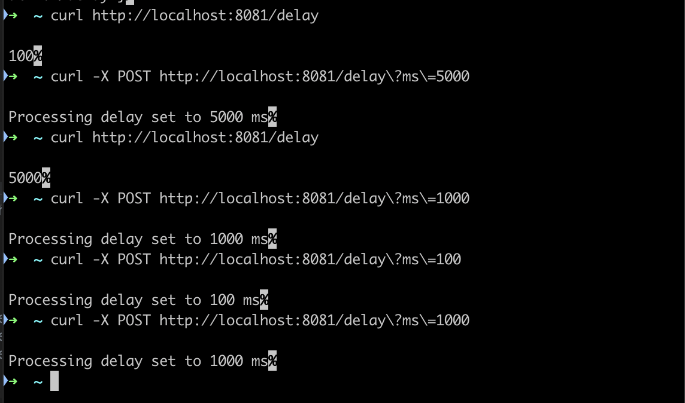

## task 1-1





## task 1-2







## task 1-3



```cd task 1-3```

```./mvnw clean spring-boot:run```

## task 2










## task 3



```cd task_3```

```./mvnw clean spring-boot:run```

Увидеть/поменять задержку:

curl http://localhost:8081/delay

curl -X POST http://localhost:8081/delay\?ms\=5000
